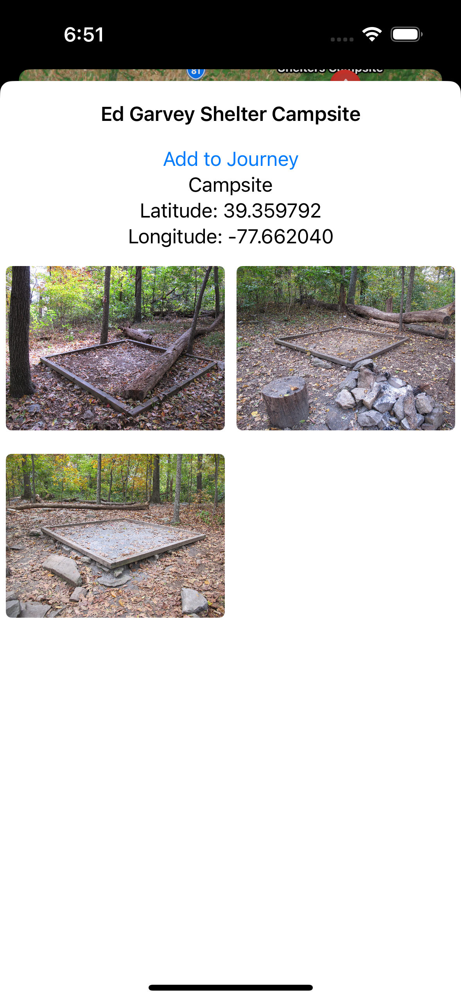

# ThruHiker

An ios app for planing your next hike on the Appalachian Trail

## Features

- View all campsites, shelters, privies, and vistas on the trail
- View details and images for every location
- Keep track of your current and future journeys

## Screenshots

## Requirements

- iOS 17
- Xcode 15
- [SQLite.swift 0.14.1](https://github.com/stephencelis/SQLite.swift).

## License

[MIT](https://choosealicense.com/licenses/mit/)

All trail data is provided by the National Park Service Appalachian National Scenic Trail & Appalachian Trail Conservancy, 2023
